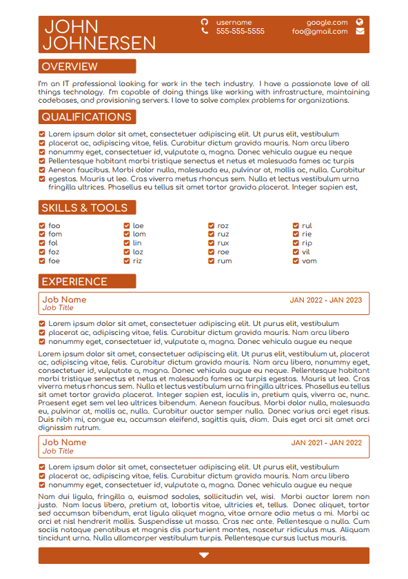

# About This Repository

This is a resume in LaTeX anyone can fork for personal use. If you have any programming experience, filling in your own data should come naturally. Submit an issue if you find any issues with data not matching up and I'll do my best to fix it =]

# Requirements

This repository assumes you're running on linux; You'll need to install some tools to build your resume. Building on windows will work just as well, but you're on your own there.

- install [TeXLive](https://www.tug.org/texlive/quickinstall.html)
- install [TeXLive-fonts-extra](https://packages.debian.org/sid/texlive-fonts-extra)
- (optional) install [LaTeX-Workshop](https://github.com/James-Yu/LaTeX-Workshop) as a vscode extension

# How to Use This Resume

To build the resume, run `latexmk` after installing the required utilities

If you intend to use the resume as-is, you can safely replace the placeholder content with your texts of choice. Edits to the content of the resume are made in the `resume.tex` file. Edits to the formatting of the resume are (generally) made in the `resume.cls` file.

Below are some common changes you might want to make, and how you can make them.

| thing to change              | how to change it                                                                                                                                                 | file       | example                                |
| ---------------------------- | ---------------------------------------------------------------------------------------------------------------------------------------------------------------- | ---------- | -------------------------------------- |
| width of skills list         | increase or decrease the number argument in `\begin{skills}{4}`                                                                                                  | resume.tex | `\begin{skills}{5}`                    |
| remove a heading contact     | modify the table definition and null out the section you intend to remove                                                                                        | resume.cls | `& & & \website & \icowebsite`         |
| color of document            | modify the color variable                                                                                                                                        | resume.tex | `\newcommand{\colour}{green}`          |
| font of document             | modify the default font in the font package declaration                                                                                                          | resume.cls | `\usepackage[default]{calibri}`        |
| margins                      | modify the geometry package arguments                                                                                                                            | resume.cls | `\geometry{superlong_margin_args}`     |
| change the bullet point icon | modify the qualifications and skills sections with a new icon from [this list](https://mirror.las.iastate.edu/tex-archive/fonts/fontawesome/doc/fontawesome.pdf) | resume.cls | `\begin{list}{\setcolor\faAngleRight}` |
